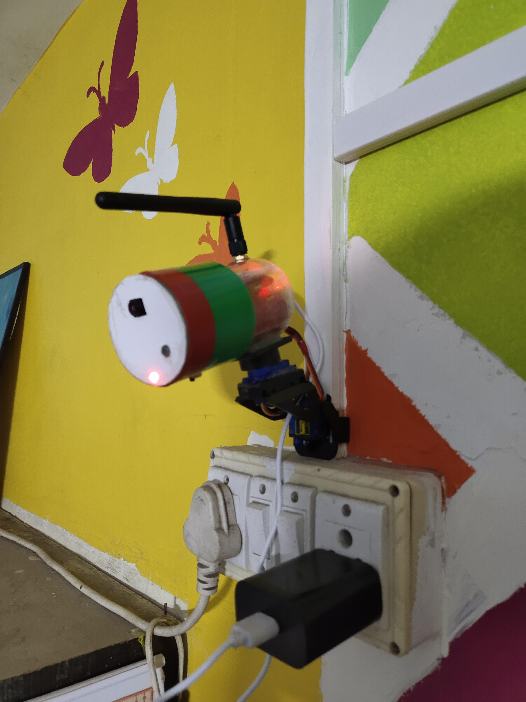

# **DIY ESP32-CAM Smart Surveillance System**  

🚀 **A low-cost, battery-powered surveillance camera with motion detection, live streaming, and Telegram bot integration!**  

## 📌 **About the Project**  
This project is a DIY smart surveillance system built using the ESP32-CAM. For better coverage, it supports motion-triggered recording, remote access, and servo-controlled movement. The recordings are automatically stored and can be accessed via a Telegram bot.  

This repository is **forked from** [s60sc's ESP32-CAM_MJPEG2SD](https://github.com/s60sc/ESP32-CAM_MJPEG2SD) and modified to add extended features.  

## 🔧 **Features**  
✅ **Live Video Streaming** – Access real-time footage remotely  
✅ **Motion Detection & Auto-Recording** – Captures only significant events  
✅ **Wide-Angle Coverage** – Servo-controlled movement for better monitoring  
✅ **Telegram Bot Integration** – View recordings anytime, anywhere  
✅ **Battery-Powered Operation** – Provides **2-3 hours of backup**, 24/7 runtime when plugged in  
✅ **Sustainable Build** – Repurposed old **laptop batteries** for eco-friendly power  
✅ **Cost-Effective** – Built under **₹700 INR** (excluding retrieved components)  

## 🛠️ **Hardware Components**  
- **ESP32-CAM** – Handles video streaming & processing  
- **TP4056 Module** – LiPo battery charging  
- **Mini DC-DC Boost Step-Up Converter Board** – Voltage regulation  
- **100µF & 10µF Capacitors** – Circuit stability  
- **2 LiPo Batteries** – Repurposed from an **old laptop battery**  
- **Two Servo Motors** – For adjustable camera movement  
- **External Antenna** – Enhances wireless connectivity  

## 🏗️ **Future Enhancements**  
🚀 **ML-powered Subject Tracking** – Auto-follow moving objects  
🚀 **Smart Alerts via SMS** – Instant notifications on motion detection  
🚀 **Enhanced Night Vision** – Better low-light performance  

## 📂 **Installation & Usage**  
### **1️⃣ Clone the Repository**  
```bash
git clone https://github.com/your-username/ESP32-CAM_Surveillance.git
cd ESP32-CAM_Surveillance
```
### **2️⃣ Flash the Code to ESP32-CAM**  
1. Install **Arduino IDE** and add the ESP32 board manager.  
2. Install required libraries (**esp32_camera, Telegram Bot, Servo, etc.**).  
3. Connect ESP32-CAM and upload the sketch.  

### **3️⃣ Connect to Telegram Bot**  
1. Create a Telegram bot using **BotFather**.  
2. Add the bot token to the code.  
3. Start receiving video footage and alerts!  

## 📸 **Project Images**  
### 📌 Camera Setup  
  

### 📌 Circuit Connection  
  

### 📌 Live Demo  
  

## 📜 **Credits & Acknowledgments**  
This project is **based on and forked from** [s60sc's ESP32-CAM_MJPEG2SD](https://github.com/s60sc/ESP32-CAM_MJPEG2SD). 
Thanks to the original developer for their work! 🙌  
For a detailed guide, refer to the original developer's repository.

If you find this useful, feel free to **⭐ star** the repo and contribute! 🔥 
